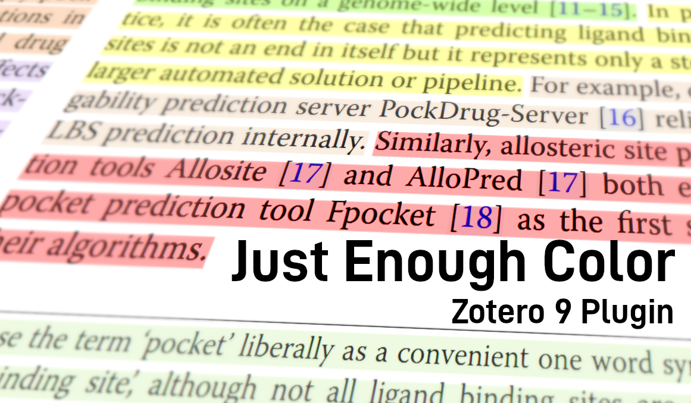

<h1 align="center">Just Enough Color</h1>

  <b>Arbitrary-color highlights &amp; underlines plugin for Zotero</b>

  

  
  
  

---

More color in Zotero reader annotations!

## Installation

1. Build the plugin: `npm install && npm run build`
2. In Zotero: `Tools -> Add-ons -> ⚙️ -> Install Add-on From File…`, choose `build/just-enough-color.xpi`
3. Restart Zotero

## Usage

1. Select text in the reader, select rainbow swatch to pick any color to highlight/underline with.
2. Right-click an existing annotation and choose `just-enough-color` to re-color it with any color.

## Features

- Custom-colored annotations behave exactly like stock ones: comments, tags, page labels and right-click color switching all work
    - This also works with other click-on translate plugins
- Recently used custom colors are persisted and can be viewed / cleared in the settings pane

## License

AGPL-3.0-or-later · Copyright © 2026 MCXCC303
